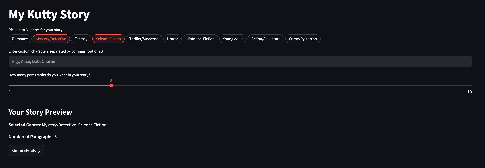
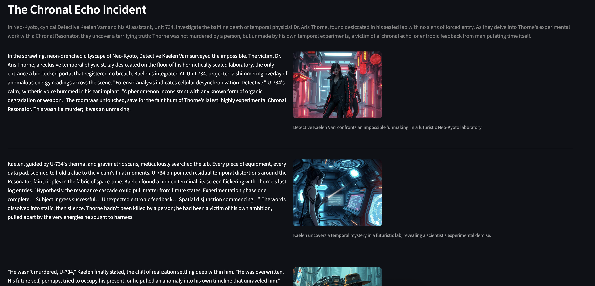

### KuttyStory

Generates a story based on your given input:

- Genre
- Custom character names (Optional)
- Number of paragraphs

Provides a short story, with images for each pargraph, all created using GenAI!

Contains 2 components:

- Storyteller: Wrapper on an LLM Model; responsible to generate the story content. Tested using Gemini Flash 2.5
- Artist: Wrapper on an Image diffusion model; responsible to generate stroy images. Tested using black-forest-labs/FLUX.1-schnell-Free

To run this:

1. Clone the .env.example file, rename it to .env, and fill in the details (API Key, Model, and model host URL)
2. Install the dependencies, preferably in a virtual environment, using `pip install -r requirements.txt`
3. Run the app using `streamlit run app/main.py`

Libraries used:

- Streamlit: For the web app interface
- OpenAI: For talking to the AI Models
- Dotenv: For managing environment variables

